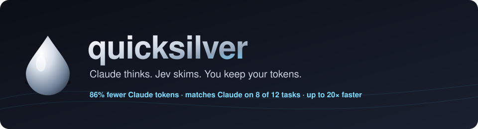
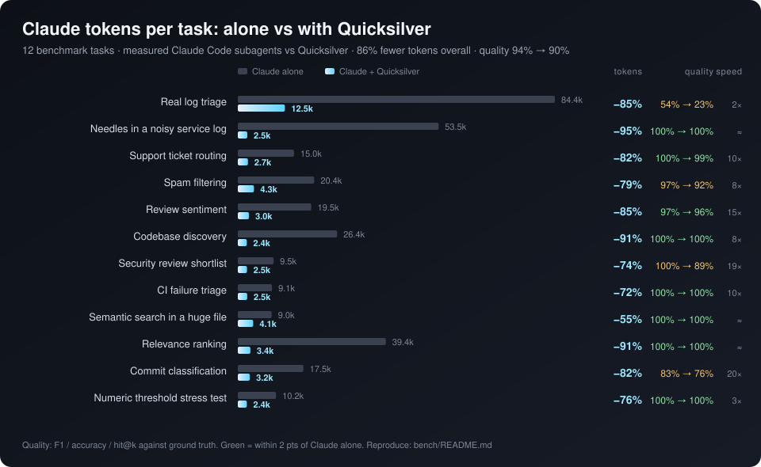

<p align="center">
  
</p>

<p align="center">
  <a href="#install"></a>
  
  
  
  
</p>

<h3 align="center">Stop paying Claude to skim.</h3>

A big share of every Claude Code session is spent reading things only to decide
whether they matter. *Which of these 187 files handle auth? Which of these 3,000
log lines are real failures? Which of these 200 tickets are refund requests?*
Claude reads it all, pays for it all, and the context fills up with noise.

**Quicksilver** is a Claude Code skill that hands those calls to
[Jev](https://docs.typesafe.ai), TypeSafe's System One model. Jev returns typed
verdicts (yes/no, a label, a score) in about a second, for $0.042 per million
tokens. Claude gets back a shortlist and spends its tokens on the thinking
only it can do.

```
you ─▶ Claude ──"which files handle auth?"──▶ quicksilver ──▶ Jev (187 files, parallel)
                                                   │
       Claude ◀──── 4 file paths + confidence ─────┘       ~2.4k tokens instead of ~26k
```

## Install

```bash
npx github:UditAkhourii/quicksilver
```

The installer copies the skill into `~/.claude/skills/quicksilver` and asks for
your Jev key **once**. Get a key at [console.typesafe.ai](https://console.typesafe.ai),
or use an [OpenRouter](https://openrouter.ai/settings/keys) key with `--provider openrouter`.
Then restart Claude Code. That's it. Claude uses the skill on its own whenever
a task looks like "read a lot to decide a little".

<details>
<summary>Other ways to install</summary>

```bash
# pass the key non-interactively (CI, dotfiles)
npx github:UditAkhourii/quicksilver install --key YOUR_JEV_KEY

# same, through OpenRouter instead of TypeSafe
npx github:UditAkhourii/quicksilver install --provider openrouter --key YOUR_OPENROUTER_KEY

# as a Claude Code plugin
/plugin marketplace add UditAkhourii/quicksilver
/plugin install quicksilver@quicksilver

# from a clone
git clone https://github.com/UditAkhourii/quicksilver && cd quicksilver && ./install.sh   # or .\install.ps1
```

`JEV_API_KEY` / `TYPESAFE_API_KEY` (TypeSafe) or `OPENROUTER_API_KEY` (OpenRouter)
in your environment also works. With keys for both, pick one per call with
`--provider`, or set `QUICKSILVER_PROVIDER=openrouter`. Needs Node 18+.
No npm dependencies.
</details>

### Make it mandatory (optional)

Having an agent set this up? Point it at [`AGENT-SETUP.md`](AGENT-SETUP.md): install, key, hooks and checks, step by step.

Claude picks the skill on its own, but you can force it for large files. Add this
`PreToolUse` hook to `~/.claude/settings.json`. It refuses whole-file `Read`s over
600 lines or 60 KB and tells Claude to run `qs find` / `qs filter` first, then read
only the hits with `offset`/`limit`:

```json
{ "hooks": { "PreToolUse": [ { "matcher": "^Read$", "hooks": [
  { "type": "command", "command": "node \"$HOME/.claude/skills/quicksilver/scripts/guard.mjs\"", "timeout": 5 }
] } ] } }
```

To see Jev at work, register the same script as a `PostToolUse` hook with matcher
`^Bash$`: after every `qs` run it shows `☿ quicksilver → Jev 12 scanned · 0.6s · jev 2.1k tok ($0.0001) · …`
in the Claude Code UI. A blocked read shows `☿ quicksilver: blocked whole Read of …`.

Tune with `QUICKSILVER_GUARD_LINES` / `QUICKSILVER_GUARD_BYTES`; `QUICKSILVER_GUARD=off` disables it.

## The benchmark

Twelve tasks a coding agent really runs into. Eight use real public data (a
supercomputer log, Banking77, UCI SMS Spam, SST-2, the Hono codebase and its git
history, lodash). Each task was solved by **a Claude Code subagent working the
normal way** (Read, Grep, Glob) and by **Claude + Quicksilver**, and both were
scored against hidden ground truth.

<p align="center"></p>

| # | Situation | Metric | Claude alone | + Quicksilver | Claude tokens | Token cut | Time | Jev cost |
|---|---|---|---|---|---|---|---|---|
| 1 | Real log triage (BGL, 2k lines) | F1 | 54% | 23% | 84.4k → 12.5k | **−85%** | 105s → 44s | $0.033 |
| 2 | Needles in a noisy service log (3k lines) | F1 | 100% | **100%** | 53.5k → 2.5k | **−95%** | 56s → 64s | $0.044 |
| 3 | Support ticket routing (Banking77, 8 intents) | acc | 100% | **99%** | 15.0k → 2.7k | **−82%** | 60s → 6s | $0.003 |
| 4 | Spam filtering (UCI SMS) | F1 | 97% | 92% | 20.4k → 4.3k | **−79%** | 61s → 8s | $0.004 |
| 5 | Review sentiment (SST-2) | acc | 97% | **96%** | 19.5k → 3.0k | **−85%** | 85s → 6s | $0.003 |
| 6 | Codebase discovery (Hono, 187 files) | F1 | 100% | **100%** | 26.4k → 2.4k | **−91%** | 43s → 6s | $0.013 |
| 7 | Security review shortlist (40 files) | F1 | 100% | 89% | 9.5k → 2.5k | **−74%** | 48s → 3s | $0.001 |
| 8 | CI failure triage (80 logs) | acc | 100% | **100%** | 9.1k → 2.5k | **−72%** | 30s → 3s | $0.002 |
| 9 | Semantic search in lodash.js (17k lines) | hit@5 | 100% | **100%** | 9.0k → 4.1k | **−55%** | 39s → 39s | $0.213 |
| 10 | "Where is X?" ranking over a repo | hit@3 | 100% | **100%** | 39.4k → 3.4k | **−91%** | 60s → 56s | $0.134 |
| 11 | Commit classification (181 real commits) | acc | 83% | 76% | 17.5k → 3.2k | **−82%** | 106s → 5s | $0.003 |
| 12 | Numeric threshold stress test | F1 | 100% | **100%** | 10.2k → 2.4k | **−76%** | 19s → 6s | $0.003 |

**Bold** = within 2 points of Claude alone.

> **The claim:** on bulk judgment work, Quicksilver cuts the tokens Claude spends by
> **86%** (median 82%). It matches Claude's accuracy on **8 of 12** real-world tasks
> and runs **up to 20× faster**, for a median of **$0.004 of Jev per task**.

Numbers are measured, not estimated, and the benchmark is fully reproducible:
see [`bench/`](bench/README.md). Claude-side tokens subtract the fixed
per-agent overhead, measured with a control task. Quicksilver is charged for
loading its SKILL.md on every task, plus every command and every byte of output
Claude reads back.

## Where it shines, and where it doesn't

**Use it for, and trust it on:**
- **Finding needles in big inputs.** Real failures in a 3,000-line log, the 4
  auth files among 187, the right function in a 17k-line file. It hit 100% on all
  of them with 91–95% fewer tokens.
- **Bulk routing with clear labels.** Support intents, CI failure causes, sentiment.
  Accuracy was 96–100%, about 10–15× faster than Claude reading each item.
- **"Where is X?" across a codebase.** 10 of 10 top-3 hits with 91% fewer tokens.

**Use it as a shortlist, and let Claude check the `?` items:**
- **Look-alike code.** On the security task it caught every vulnerable file, but
  it also flagged safe twins at p≈0.5–0.65. Those are exactly the items
  Quicksilver marks as borderline for Claude to review.
- **Subjective or house-style labels.** Commit types (`perf` vs `refactor`)
  scored 76% against Claude's 83%.
- **Labels that encode unwritten policy.** The BGL supercomputer log's
  "alert" labels mark many FATAL lines as normal. Claude alone only reached 54% F1
  there, and Quicksilver 23%.

**Don't use it for:** writing, editing, multi-step reasoning, or anything `grep`
answers exactly. On huge scans (thousands of Jev calls) wall-clock time is about
the same as Claude's. The win there is tokens and context, not speed. Add
`--fast` to pack items and go about 10× faster on obvious needles.

## What Claude can do with it

```bash
qs filter   "Does this file handle user sessions?" src           # which files matter
qs filter   "Does this line report a failure?" app.log --lines    # log triage, repeats collapsed
qs classify --labels "bug,feature,question" --items issues.jsonl # bulk routing
qs rank     "where do we issue refunds?" src --top 5              # relevance ranking
qs find     "the retry backoff logic" huge_module.py              # locate lines in huge files
qs ask      "Does this contract allow termination without notice?" --state @contract.txt
qs status                                                          # key check + lifetime tokens saved
qs gain                                                            # savings by command, project, day (--history N: per run)
```

The output is built for an LLM to read: one line per hit, repeated log patterns
collapsed into line-number ranges, classify results as id lists, and a `?` on
anything borderline. Every run ends with a receipt:

```
— 3000 scanned · 6 matched · 0 borderline · 64.2s · jev 1.0M tok ($0.0436) · ~56k Claude tokens not read
```

## Better prompting, for free

Quicksilver quietly changes how Claude prompts. Instead of "read all of this and
tell me what matters", Claude has to state **one narrow, typed judgment**: a
yes/no condition, a closed set of labels, or a rubric. That's the same
discipline that makes any LLM prompt reliable. The skill teaches it explicitly:
one judgment per question, exact boundary cases, a catch-all label, and no
arithmetic or dates. The question becomes a reusable, testable unit rather than
a vibe.

## Safety

- It never sends `.env*`, private keys, certificates, or credentials files. It
  respects `.gitignore`, and skips binaries and files over 2 MB.
- Content goes to TypeSafe's API (`api.typesafe.ai`), or to OpenRouter
  (`openrouter.ai`) when that provider is selected. TypeSafe states that Jev
  is not trained on customer data. Don't point it at anything you can't send to
  a third party.
- The key is stored in `~/.quicksilver/config.json` with user-only permissions.
  `npx github:UditAkhourii/quicksilver setup --remove [--provider openrouter]` deletes it.

## FAQ

**Does this replace Claude?** No. Jev can't write, reason, or edit. Quicksilver
makes Claude cheaper by keeping skimming out of its context.

**What does Jev cost?** $0.042 per million input tokens, and output is free. The
whole 12-task benchmark cost $0.45 of Jev.

**Is this official?** No. It's an independent open-source project, not affiliated
with Anthropic or TypeSafe AI.

## License

MIT © Udit Akhouri
